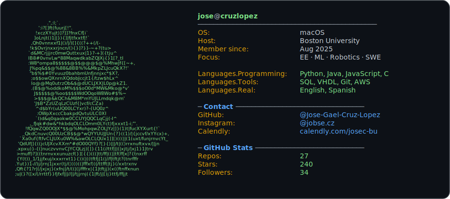

  

  
  

  

  
  

---

## About Me

I'm Jose Cruz 🇲🇽—first-gen/low-income and passionate about helping others break into tech.  
I created an Instagram page [@jobse.cz](https://instagram.com/jobse.cz) to advocate for opportunities and support people in the tech industry—sharing internships, advice, resume tips, and more.  
Views in the first week: 13.0k. Going on the second week!

After countless coffee chats and messages, this page is my way to help everyone I can. Feel free to schedule a chat—I'd love to connect! [Calendly](https://calendly.com/josec-bu)

Outside of tech, I ampliy hidden voices through creative writing, storytelling, and as a table tennis player. I’m a first-gen advocate for inclusive maker spaces, and I love exploring Boston’s trails. I know what it’s like to be lost and hidden, so my goal is to help you build confidence and persevere against all odds.

---

  

---

<h2>🚀&nbsp; Some Tools I Have Used and Learned</h2>

  
  
  
  
  
  
  
  
  
  
  
  
  
  
  
  
  
  
  
  
  

