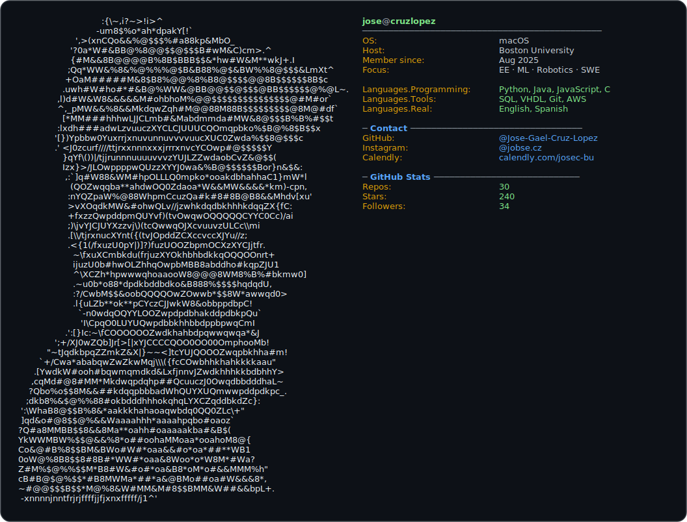

  

  
  

---

# Hi 👋 I'm Jose Cruz

## 🦉 About Me:
👋 Hi, I’m Jose Cruz—a Mexican computer engineering student at BU and storyteller in tech.  
🤖 I love building with code, data, and hardware (Python, control eng, 3D CAD, cloud).  
✨ Passionate about equity, creative writing, and inclusive maker spaces.  
🏓 Table tennis player & always up for tech collabs!  
🔎 Seeking summer 2026 roles in EE, ML, robotics, or SWE.

## 🚀 What I'm Up To
- 🧠 Exploring Machine Learning with [scikit-learn](https://scikit-learn.org/)
- 🗄️ Building Spring Boot applications with PostgreSQL

## 👤 About Me
I'm Jose Cruz 🇲🇽—first-gen/low-income and passionate about helping others break into tech.  
I created an Instagram page [@jobse.cz](https://instagram.com/jobse.cz) to advocate for opportunities and support people in the tech industry—sharing internships, advice, resume tips, and more.  
Views in the first week: 13.0k. Going on the second week! 💪

After countless coffee chats and messages, this page is my way to help everyone I can. Feel free to schedule a chat—I'd love to connect! [Calendly](https://calendly.com/josec-bu)

Outside of tech, I ampliy hidden voices through creative writing, storytelling, and as a table tennis player. I’m a first-gen advocate for inclusive maker spaces, and I love exploring Boston’s trails. I know what it’s like to be lost and hidden, so my goal is to help you build confidence and persevere against all odds.

## 💻 Tech Stack:

**Languages:**  
       

**Developer Tools:**  
  

**Libraries/Frameworks:**  
      
  
